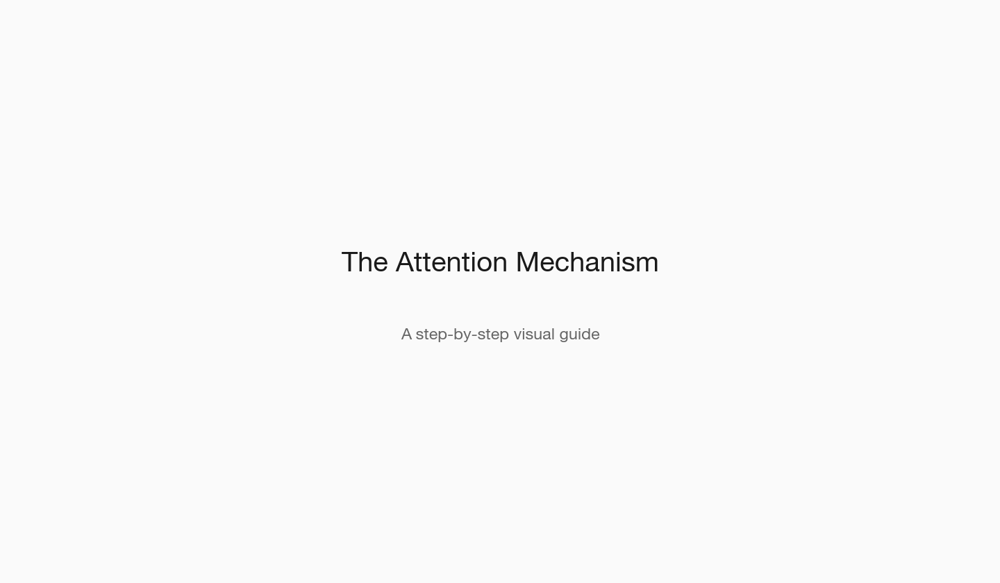
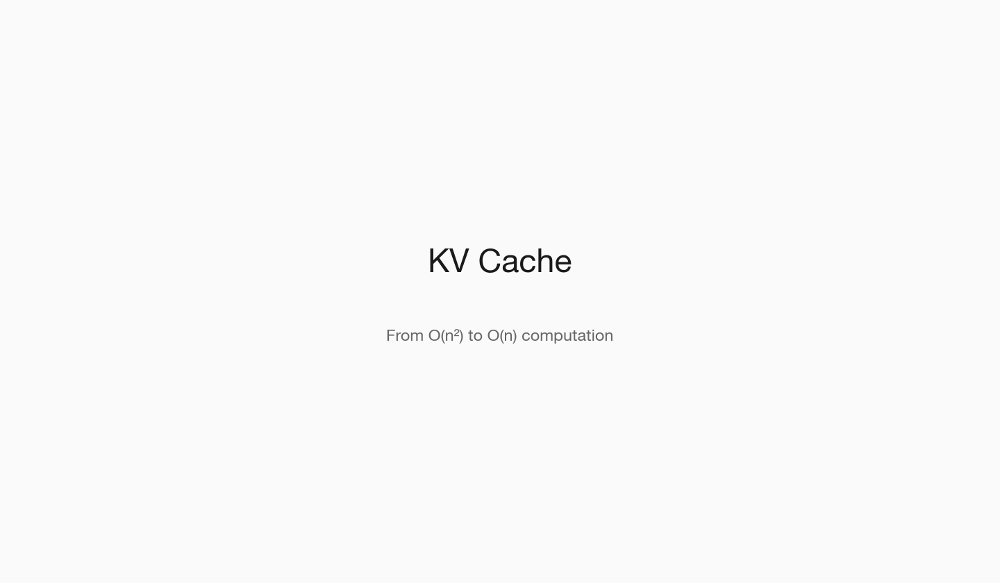
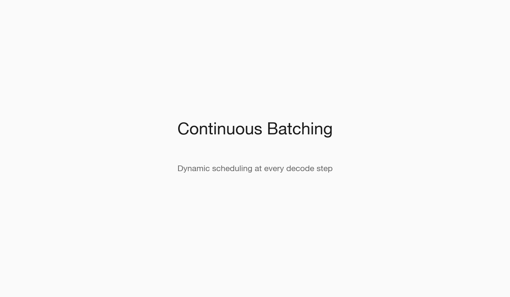
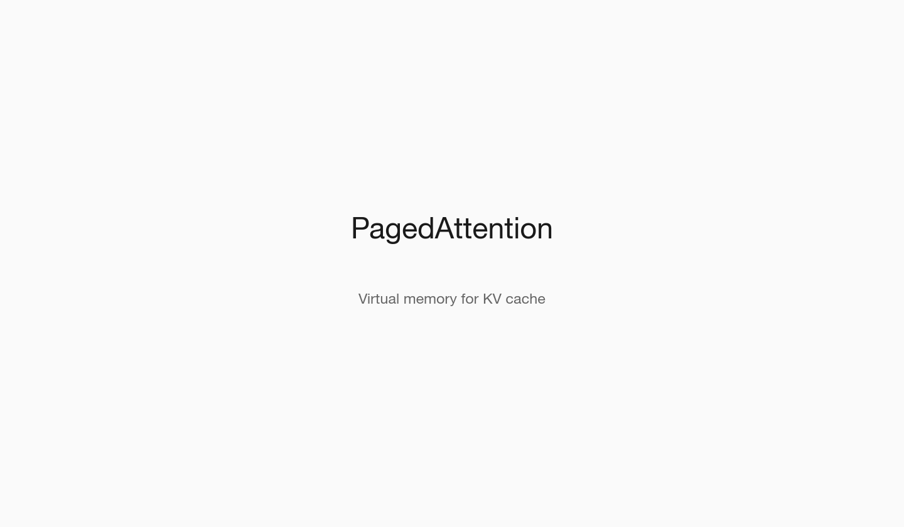
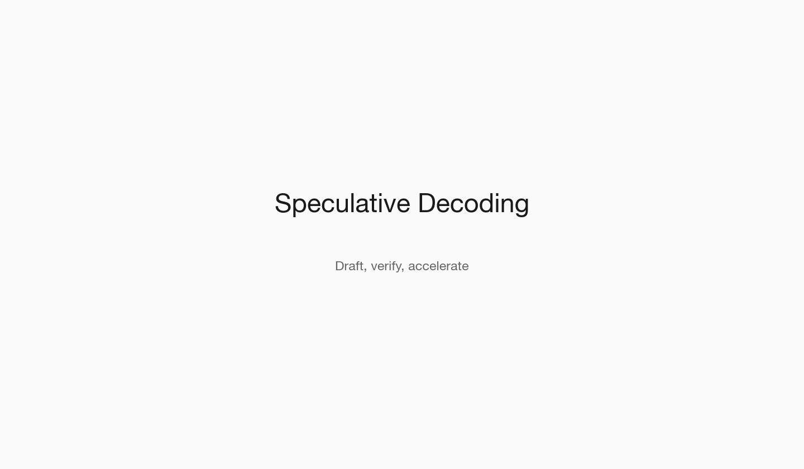

# Scaling LLM Inference to Millions of Users

*A Technical Deep Dive*

**How we go from 30 tokens per second to 3,500+ through a series of elegant optimizations.**

---

Every time you send a message to ChatGPT, Claude, or any other AI assistant, something remarkable happens. A neural network with billions of parameters processes your words and generates a response, one token at a time. This seems simple enough, but the engineering required to make this fast and affordable is anything but.

Consider the numbers: a 7-billion parameter model stores its weights in 16-bit floating point (FP16), requiring exactly 14 gigabytes of memory. For every single token generated, the decode phase must read these 14 GB from GPU high-bandwidth memory (HBM). On an NVIDIA A100 with 2 TB/s memory bandwidth, that's a theoretical minimum of 7 milliseconds per token—a hard physical limit dictated by memory bandwidth, not compute.

At that rate, generating a 200-token response takes 1.4 seconds *per user*. Scale to a million concurrent users, and you'd need roughly 10,000 A100 GPUs just to keep up—at $10,000+ per GPU, that's a $100 million infrastructure bill before you've even considered redundancy.

This is the story of how we make it work.

---

## The Two Phases of Inference

Understanding LLM inference requires understanding its two distinct phases, each with fundamentally different computational characteristics and bottlenecks.

### Quick Primer: The Attention Operation

Before diving into the phases, we need to understand attention—the operation that dominates transformer compute and memory. Attention allows each token to "look at" every other token in the sequence, computing relevance scores and aggregating information.

For each token, we compute three vectors by multiplying its embedding by learned weight matrices:

- `Q = X · W_Q` (Query: "what am I looking for?")
- `K = X · W_K` (Key: "what do I contain?")
- `V = X · W_V` (Value: "what information do I provide?")

The attention computation is then:

```
Attention(Q, K, V) = softmax(Q · K^T / √d_k) · V
```

where `d_k` is the dimension of the key vectors (typically 128). The division by `√d_k` prevents the dot products from growing too large, which would push softmax into regions with vanishing gradients.


*Animated walkthrough: how attention computes contextual representations*

**Why is this expensive?** The `Q · K^T` operation produces an `n × n` attention matrix, where `n` is sequence length. This is O(n²) in both compute and memory. For a 4096-token sequence, that's 16 million attention scores *per layer, per head*. With 32 layers and 32 heads, we're computing over 16 billion attention scores.

**The key insight for inference**: during decode, we generate one token at a time. The new token's Q vector (dimension `1 × d_k`) needs to attend to all previous tokens' K and V vectors. We don't need to recompute the old tokens' Ks and Vs—they haven't changed. This observation is the foundation of the KV cache optimization.

### Prefill: Processing the Prompt

When you send a prompt to an LLM, the model must first process every token in your input. This is the **prefill phase**. All input tokens are processed in parallel in a single forward pass—we compute Q, K, and V for all tokens simultaneously and perform the full attention computation.

Prefill is **compute-bound**. The GPU's tensor cores are fully utilized performing matrix multiplications. For a prompt of length `P` tokens with hidden dimension `H`, the prefill computation is dominated by:

- QKV projection: `3 × P × H²` FLOPs per layer
- Attention: `2 × P² × H` FLOPs per layer (the O(n²) term)
- FFN: `16 × P × H²` FLOPs per layer (assuming 4H intermediate dim)

For Qwen2.5-7B with H=4096 and a 1024-token prompt across 32 layers, that's roughly 150 billion FLOPs—well within the A100's 312 TFLOP/s FP16 capability. Prefill completes in hundreds of milliseconds.

### Decode: Generating the Response

After prefill comes the **decode phase**, which is fundamentally different. We generate output tokens one at a time, autoregressively—each new token's probability distribution depends on all previous tokens.

For each decode step, we must:

1. Load the model weights (14 GB) from HBM to compute units
2. Compute Q for the new token, K and V for just the new token
3. Compute attention: Q_new · K_all^T (using cached K) → softmax → multiply by V_all
4. Pass through the FFN layers
5. Sample the next token from the output distribution

Decode is **memory-bandwidth-bound**. The arithmetic intensity (FLOPs per byte loaded) is extremely low—we load 14 GB of weights to perform just a few million FLOPs for a single token. The GPU's compute units sit mostly idle, waiting for data to arrive from HBM. This is the fundamental bottleneck: we're limited by memory bandwidth, not compute.

> **The Roofline Model**
>
> `Attainable FLOP/s = min(Peak FLOP/s, Bandwidth × Arithmetic Intensity)`
>
> Decode has arithmetic intensity ~0.5 FLOP/byte. A100: 2 TB/s × 0.5 = 1 TFLOP/s (vs 312 TFLOP/s peak). We're at 0.3% compute utilization.

---

## Why Naive Inference Fails

A straightforward implementation of LLM inference hits several walls almost immediately. Understanding these problems precisely is essential for understanding the solutions.

### Problem 1: Redundant Computation

Without caching, we would recompute Keys and Values for *every previous token* at each decode step. At step `t`, we'd compute K and V for all `t` tokens, even though tokens 1 through t-1 haven't changed.

The cost grows quadratically. To generate token 100, we'd perform 100× the work of generating token 1. For a 1000-token response, total work is proportional to 1 + 2 + 3 + ... + 1000 = 500,500 forward passes worth of KV computation—when we really only needed 1000.

Concretely, for Qwen2.5-7B: each token's KV computation requires ~8 million FLOPs per layer × 32 layers = 256 million FLOPs. Recomputing all previous tokens at step 1000 would cost 256 billion FLOPs—a 1000× overhead that compounds with every generated token.

| Token | Work Required |
|-------|---------------|
| Token 1 | Compute K,V for token 1 → 256M FLOPs |
| Token 2 | Compute K,V for tokens 1,2 → 512M FLOPs |
| Token 100 | Compute K,V for tokens 1-100 → 25.6B FLOPs |
| Token 1000 | Compute K,V for tokens 1-1000 → 256B FLOPs |

### Problem 2: Static Batching

To amortize the cost of loading model weights, we want to process multiple sequences simultaneously—a technique called batching. With batch size B, we load the weights once and use them for B sequences, improving arithmetic intensity by factor B.

The naive approach is **static batching**: group N requests together at the start and process them as a unit. Each decode step generates one token for all sequences in the batch.

The problem? All sequences in a batch must wait for the longest one to finish. If one user asks "What is 2+2?" (generates 1 token: "4") and another asks for a 500-word essay (generates 650 tokens), the first user waits for all 650 decode steps before receiving their response.

Worse, once a sequence finishes, its "slot" in the batch sits empty. If 7 out of 8 sequences finish early, we're running at 12.5% efficiency for the remainder of the batch. The GPU is doing 7/8ths useless work.

### Problem 3: Memory Fragmentation

The KV cache grows dynamically as we generate tokens—but we don't know the final sequence length in advance. Naive implementations pre-allocate memory for the maximum possible length (e.g., 4096 tokens).

Let's do the math for Qwen2.5-7B. Per token, we store K and V across 32 layers, 4 KV heads (Grouped-Query Attention), 128 dimensions per head, in FP16:

```
KV per token = 2 × 32 × 4 × 128 × 2 bytes = 65 KB
```

Pre-allocating for 4096 tokens: `65 KB × 4096 = 267 MB per sequence`. On a 40GB A100, after loading the 14GB model, we have 26GB left. That's only **97 sequences maximum**.

But if average response length is 200 tokens, we're using only 5% of our pre-allocated KV cache memory. Effective batch size drops from 97 to what could have been 2000+ sequences—a 20× efficiency loss.

Fragmentation also occurs over time. As sequences of different lengths complete and new ones arrive, we get "holes" of unusable memory scattered across GPU HBM. These fragments can't be coalesced without expensive memory compaction.

**Naive performance:** ~40 tokens/sec, ~35% memory utilization

---

## Enter vLLM

vLLM, developed at UC Berkeley in 2023, implements three key innovations that address each of these problems. These optimizations are so fundamental that they're always enabled—there's no "turn off" switch.

### Solution 1: KV Cache

The fix for redundant computation is simple: compute K and V for each token exactly once, then cache them in GPU memory. At decode step `t`, we only compute K_t and V_t for the new token, then concatenate with the cached K_{1:t-1} and V_{1:t-1}.

This transforms O(n²) total work into O(n). The tradeoff: we now need memory proportional to sequence length. For Qwen2.5-7B with GQA (4 KV heads), that's 65 KB per token—manageable, but it adds up.

The cache lookup is essentially free: the K and V tensors are already contiguous in memory, so attention becomes:

```
attn_output = softmax(Q_new @ K_cache^T / √d) @ V_cache
```

where `K_cache` is shape `[seq_len, num_kv_heads, head_dim]`. No recomputation, just a matrix multiply against cached values.


*Animated walkthrough: how KV caching eliminates redundant computation*

**Grouped-Query Attention (GQA)**: Modern models like Qwen2.5-7B use GQA, where multiple query heads share the same KV heads. With 28 query heads and 4 KV heads, we get 7× KV cache reduction compared to standard multi-head attention—critical for fitting longer sequences in memory.

### Solution 2: Continuous Batching

Instead of waiting for all sequences to complete, **continuous batching** (also called iteration-level batching) makes scheduling decisions at every decode step.

The scheduler maintains a pool of active sequences. At each iteration:

1. Complete any sequences that generated an EOS token
2. Evict completed sequences from the batch
3. Fill empty slots with waiting requests from the queue
4. Execute one decode step for the entire batch

Short requests finish and leave immediately; their slots are filled by waiting requests. Long requests don't block anyone. The GPU stays at maximum utilization.

The key insight: all sequences in a batch execute the same operations (one decode step), regardless of their history or future length. We're not "waiting" for anything—every slot is always doing useful work.


*Animated walkthrough: dynamic scheduling at every decode step*

**Memory management complexity**: With sequences constantly entering and leaving the batch, their KV caches must be efficiently managed. This is where PagedAttention becomes essential.

### Solution 3: PagedAttention

This is vLLM's signature contribution. Inspired by OS virtual memory, PagedAttention solves memory fragmentation by dividing the KV cache into fixed-size **blocks** (default: 16 tokens per block) that can be stored non-contiguously.

Each sequence maintains a **block table**—a simple array mapping logical block indices to physical block locations in GPU memory. When attention needs to access the KV cache for sequence `s`, it:

1. Looks up the block table for sequence `s`
2. Translates logical positions to physical memory addresses
3. Gathers the K and V vectors from scattered physical blocks
4. Performs attention as normal

**Memory allocation**: Blocks are allocated on-demand from a free list. When a sequence generates its 17th token, a new block is allocated. When a sequence completes, its blocks return to the free list. No pre-allocation, no fragmentation.

**Copy-on-Write for beam search**: Multiple beams can share the same physical blocks for their common prefix. Blocks are only copied when a beam diverges and needs to modify cached values.

The overhead is minimal: one level of indirection in memory access, which is overlapped with computation. Memory utilization jumps from ~35% to over 95%. This directly translates to ~3× more sequences per batch, and thus ~3× higher throughput.


*Animated walkthrough: virtual memory for KV cache*

**vLLM performance:** ~600 tokens/sec, 15× improvement over naive

---

## Going Further

The three core optimizations get us to 600 tokens/second. But we can push further with techniques that trade various resources for speed.

### Quantization

Model weights in FP16 use 2 bytes per parameter. **Quantization** compresses them to fewer bits—INT8 (1 byte) or INT4 (0.5 bytes)—with minimal accuracy loss.

**How it works**: Weights are linearly mapped to a smaller range. For INT8: find the min/max of each tensor, compute a scale factor `s = (max - min) / 255`, then store `w_int8 = round((w - min) / s)`. At runtime, dequantize: `w ≈ w_int8 × s + min`.

**Why it helps inference**: Decode is memory-bound. INT4 weights are 4× smaller than FP16, so we load 4× less data from HBM. If memory bandwidth is the bottleneck (it is), throughput increases proportionally.

**AWQ (Activation-aware Weight Quantization)**: Not all weights are equally important. AWQ identifies "salient" weights—those that process large activation magnitudes—and preserves their precision. This achieves INT4 with negligible accuracy loss on most benchmarks.

**The catch**: Quantized matmul requires dequantizing weights before computation, adding FLOPs. But since we're memory-bound, we have spare compute cycles. The tradeoff is favorable: 2× throughput gain, <1% accuracy loss on typical tasks.

| Format | Size |
|--------|------|
| FP16 | 14 GB |
| INT8 | 7 GB |
| INT4 | 3.5 GB |


*Animated walkthrough: shrinking models while preserving quality*

### Prefix Caching (Automatic Prompt Caching)

Many requests share identical prefixes—system prompts, few-shot examples, or document contexts. **Prefix caching** stores the KV cache for common prefixes and reuses it across requests.

**Implementation**: vLLM hashes the token sequence of each block. When a new request arrives, it checks if any prefix blocks' hashes match cached blocks. On a hit, those blocks are reused—no prefill computation needed for the cached portion.

**Impact on TTFT**: For a 2000-token system prompt followed by a 100-token user query, naive prefill processes all 2100 tokens. With prefix caching and a warm cache, we only prefill the 100 new tokens—a 20× reduction in time-to-first-token.

**Memory tradeoff**: Cached prefixes consume GPU memory. vLLM uses an LRU eviction policy, keeping frequently-used prefixes hot. For applications with consistent system prompts, hit rates exceed 90%.

### Speculative Decoding

Here's a counterintuitive idea: use a smaller, faster **draft model** to generate multiple candidate tokens, then **verify** them in parallel with the large target model.

**The algorithm**:

1. Draft model generates K tokens autoregressively (fast, ~5ms for K=5)
2. Target model processes all K tokens in one forward pass (same cost as 1 token)
3. Compare draft vs target distributions at each position
4. Accept tokens where distributions match; reject and resample where they diverge
5. Guaranteed to produce identical output distribution to running target alone

**Why it works**: For "easy" tokens (common words, predictable syntax), draft and target agree. We accept all K tokens, generating K tokens for the cost of 1 target forward pass. For "hard" tokens, we fall back to target-only generation.

**Acceptance rate**: With a well-matched draft model (e.g., Qwen2.5-1.5B drafting for Qwen2.5-7B), acceptance rates of 70-80% are typical. Effective speedup: 2-3× on latency for single sequences.

**Caveats**: Speculative decoding helps latency but not throughput. It requires loading two models in memory. And it's most beneficial for latency-sensitive, single-sequence workloads—less impactful when you're already batching heavily.


*Animated walkthrough: draft, verify, accelerate*

### Chunked Prefill

Long prompts create latency spikes. A 10,000-token document takes hundreds of milliseconds to prefill. During this time, all other sequences in the batch are blocked—no decode progress for anyone.

**Chunked prefill** breaks long prompts into smaller chunks (e.g., 512 tokens). The scheduler interleaves prefill chunks with decode steps:

1. Prefill chunk 1 (512 tokens) for new request
2. Decode step for all active sequences
3. Prefill chunk 2 for new request
4. Decode step for all active sequences
5. ...and so on

**Impact**: Existing sequences continue generating tokens during long prefills. Inter-token latency (ITL) stays consistent. P99 latency drops dramatically for decode-heavy workloads.

**Tradeoff**: Total prefill time increases slightly (more kernel launches, less compute efficiency). But for production systems prioritizing consistent latency over raw throughput, it's essential.

---

## Scaling to Millions of Users

Everything so far optimizes a single GPU. But to serve millions of concurrent users, we need to scale both vertically (bigger/more GPUs per model) and horizontally (more model replicas). Each approach has distinct tradeoffs.

### Tensor Parallelism: Splitting Layers Across GPUs

**Tensor Parallelism (TP)** partitions individual weight matrices across multiple GPUs. Each GPU holds a slice of every layer and computes a partial result. The partials are then combined via all-reduce communication.

For a linear layer `Y = XW` with TP=2, we split W column-wise:

- GPU 0 computes: `Y_0 = X · W[:, :H/2]`
- GPU 1 computes: `Y_1 = X · W[:, H/2:]`
- Concatenate: `Y = [Y_0, Y_1]`

For attention, we partition heads across GPUs. With 28 query heads and TP=4, each GPU handles 7 heads. The KV cache is similarly partitioned—each GPU only stores K and V for its assigned heads.

**Communication overhead**: After each transformer block, GPUs must synchronize via **all-reduce**—every GPU sends its partial activations to every other GPU and sums them. For TP=N, each all-reduce transfers `O(batch × seq_len × hidden_dim)` bytes across all N GPUs.

**The interconnect matters enormously**:

- **NVLink** (A100/H100): 600-900 GB/s bidirectional. All-reduce for 4KB activations: ~7µs
- **PCIe 4.0 x16**: 32 GB/s. Same all-reduce: ~125µs—18× slower

With ~100 all-reduces per forward pass (2 per layer × 32 layers + embeddings), PCIe adds 12.5ms latency per token. NVLink adds 0.7ms. This is why TP is practical only with NVLink.

**Scaling limits**: TP reduces per-GPU memory (good) but adds communication (bad). Beyond TP=8, communication overhead dominates. Diminishing returns kick in hard.

### Pipeline Parallelism: Splitting Layers Sequentially

**Pipeline Parallelism (PP)** assigns different layers to different GPUs. GPU 0 runs layers 0-15, GPU 1 runs layers 16-31. Activations flow sequentially through the pipeline.

PP has lower communication than TP: only one point-to-point transfer between pipeline stages (vs all-reduce at every layer). But it introduces **pipeline bubbles**—GPUs sit idle waiting for activations from previous stages.

**Micro-batching** mitigates bubbles: split a batch into micro-batches and overlap their execution. While GPU 1 processes micro-batch 1's layer 16-31, GPU 0 processes micro-batch 2's layer 0-15. With enough micro-batches, bubble overhead drops to ~5-10%.

PP is rarely used alone for inference (latency-sensitive). It's more common in training or combined with TP: `TP=4, PP=2` on 8 GPUs means 4-way tensor parallel within each pipeline stage.

### Horizontal Scaling: Model Replicas

Vertical scaling (TP/PP) has limits. A single 8-GPU node with TP=8 might achieve 3,500 tok/s. To serve 1 million users generating 100 tok/s each, you need 100M tok/s total—roughly **28,500 replicas**.

Horizontal scaling deploys independent model replicas behind a load balancer. Each replica is a complete inference server (potentially multi-GPU with TP). Replicas share nothing—they're stateless and independently scalable.

**Load balancing strategies**:

- **Round-robin**: Simple, but ignores request complexity. A 10-token request and 1000-token request get equal weight.
- **Least-connections**: Route to replica with fewest active requests. Better, but still ignores token count.
- **Token-aware routing**: Estimate output length from prompt, route to balance total tokens-in-flight. Best for throughput.
- **Prefix-aware routing**: Route requests with matching prefixes to the same replica to maximize prefix cache hits. Critical for multi-turn conversations.

**Replica sizing tradeoffs**:

- **Fewer large replicas** (TP=8): Higher per-replica throughput, better batching efficiency, but coarse-grained scaling and expensive failure domains.
- **Many small replicas** (TP=1 or TP=2): Fine-grained scaling, cheaper failure domains, but lower per-replica throughput and more total GPUs needed for same capacity.

### The Economics of Scale

Let's work through real numbers for serving 1 million concurrent users, each generating 50 tokens/second average (streaming responses).

**Total throughput required**: 1M users × 50 tok/s = 50 million tokens/second.

**Per-replica throughput** (Qwen2.5-7B-AWQ on 2×A100 with TP=2): ~2,200 tok/s at batch size 256.

**Replicas needed**: 50M / 2,200 = **22,727 replicas** = **45,454 A100 GPUs**.

**Cost estimate** (cloud pricing ~$2/GPU-hour):

- Hourly: 45,454 × $2 = **$90,908/hour**
- Monthly: $90,908 × 720 = **$65.5M/month**
- Per user per month: $65.5M / 1M = **$65.50/user/month**

This is why inference costs dominate AI company expenses. Every optimization in this article—KV cache, PagedAttention, quantization, batching—directly reduces this number. A 2× throughput improvement halves your GPU bill.

**Smaller models matter**: The same analysis with a 1.5B model (7× smaller) at 8,000 tok/s per GPU:

- GPUs needed: 50M / 8,000 = 6,250 GPUs
- Monthly cost: ~$9M/month = $9/user/month

This is why there's intense research into distillation, pruning, and training smaller models that match larger model quality.

---

## The Results

Putting it all together, here's what we achieve on Qwen2.5-7B-Instruct:

| Configuration | Throughput |
|---------------|------------|
| Naive HuggingFace | 40 tok/s |
| vLLM (base) | 600 tok/s |
| + Quantization (AWQ) | 1,100 tok/s |
| + 2× A100 (TP=2) | 2,200 tok/s |
| + 4× A100 (TP=4) | **3,500+ tok/s** |

From 40 to 3,500+ tokens per second. An **87× improvement** through systematic optimization of memory bandwidth, memory utilization, and parallelism.

The key insight: LLM inference is not compute-limited, it's memory-limited. Every optimization here—KV caching, PagedAttention, quantization—ultimately serves one goal: maximizing the useful work done per byte transferred from HBM.

These are the techniques that power every major AI service today. The same principles apply whether you're running a 7B model or a 70B model, on one GPU or one hundred.

---

## Resources

- [vLLM GitHub](https://github.com/vllm-project/vllm)
- [Qwen2.5-7B on HuggingFace](https://huggingface.co/Qwen/Qwen2.5-7B-Instruct)
- [vLLM Documentation](https://docs.vllm.ai/)
